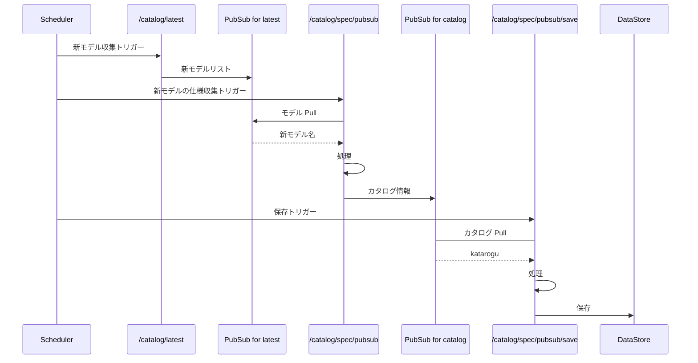

# /api
This api dir if for the b-moz presentation layer.

## collect

Collect api is for collecting catalog information from the web.

- /api/v1/collect/catalog/latest
  - Collect the latest catalog information from the web. 
    - body: {"category": "android"}
  - This publishes the collected information to the pubsub that is used in the following APIs.
- /api/v1/collect/catalog/spec
  - Collect the specific catalog information for given target from the web.
    - body: {"target": "pixel 8", category: "smartphone"} 
  - By default, the collected information is pushes to the pubsub.
  - If you want to save the information to the spreadsheet, you should include `mode` field as `SS_SAVE` in the payload.
- /api/v1/collect/catalog/spec/pubsub
  - Collect the specific catalog information from the web by pubsub.
- /api/v1/collect/catalog/spec/pubsub/save
  - Save the specific catalog information from the web, that are in the pubsub.

